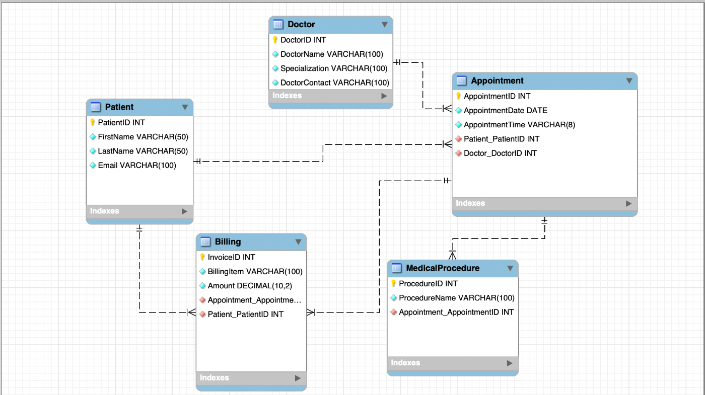
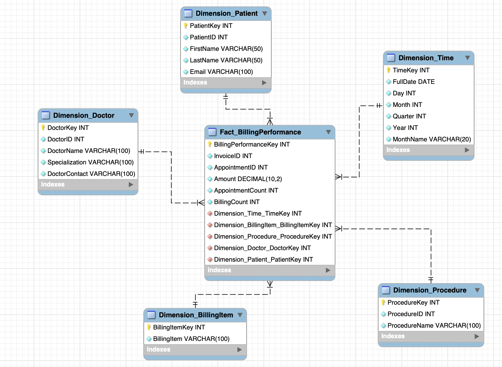
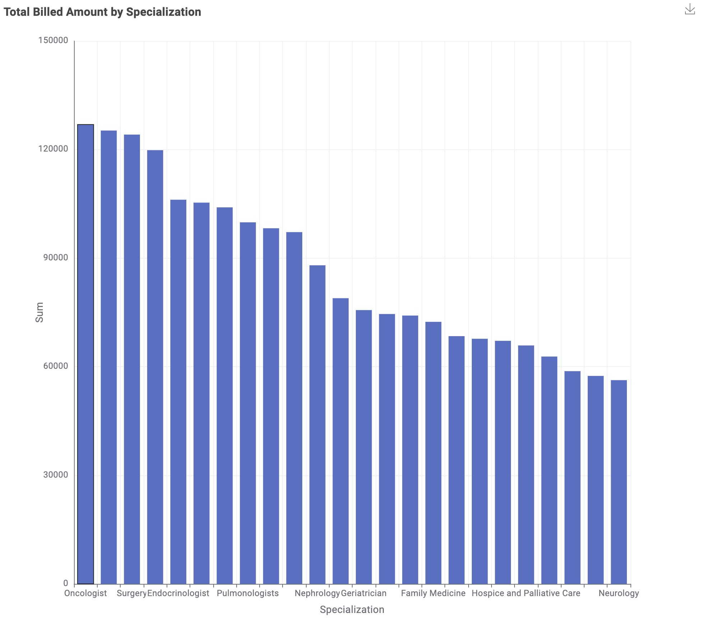

# Healthcare Clinic Billing Performance Data Warehouse

## Overview
A data warehouse for a fictional healthcare clinic network, built to monitor
billing performance across doctors, medical procedures and time.

The clinic's data sat in separate operational tables, which made it hard for
management to see patterns in billing. Without that view the network cannot
plan doctor capacity, allocate resources to specific procedures, or anticipate
busy and quiet periods. The warehouse brings the data together so those
questions can be answered with one query instead of several.

Business Intelligence for Data Science, MSc Data Science & Society, Tilburg
University. Group project.

## Business questions
- Which medical specializations generate the highest billed revenue?
- Which medical procedures are billed most often?
- How does billing activity change across months and years?

## Source database (OLTP)

| Table              | Holds                                          |
| ------------------ | ---------------------------------------------- |
| `Patient`          | patient identity and contact details            |
| `Doctor`           | doctor name, specialization and contact         |
| `Appointment`      | date and time, linked to a patient and a doctor |
| `MedicalProcedure` | the procedure performed at an appointment       |
| `Billing`          | invoice lines with the billed amount            |

Full definitions with types, keys and foreign keys are in
[`schema_oltp.sql`](schema_oltp.sql).

## Data warehouse (star schema)

One fact table surrounded by five dimensions. The dimensions are flat and join
directly to the fact table, which keeps queries simple and fast.

| Dimension              | Purpose                             |
| ---------------------- | ----------------------------------- |
| `Dimension_Time`       | the time context of the billing     |
| `Dimension_Doctor`     | the attending doctor                |
| `Dimension_Patient`    | the patient                         |
| `Dimension_Procedure`  | which medical procedure was done    |
| `Dimension_BillingItem`| what was billed                     |

`Fact_BillingPerformance` carries three measures:

| Measure            | What it tells you                                            |
| ------------------ | ------------------------------------------------------------ |
| `Amount`           | how much was billed                                           |
| `AppointmentCount` | workload and capacity use                                     |
| `BillingCount`     | how many invoice lines, so the administrative load            |

`Amount` says how much was billed, and the two counts help explain why it is
high or low. A large billed amount can come from many appointments, many
invoice lines, or a few expensive procedures.

Full definitions are in [`schema_warehouse.sql`](schema_warehouse.sql).

## ETL
Built in KNIME Analytics Platform, reading from and writing to MySQL. The
dimensions are loaded first, then the fact table, so every foreign key it needs
already exists.

| Workflow                                    | Nodes | What it does                                                                 |
| ------------------------------------------- | ----- | ---------------------------------------------------------------------------- |
| `Healthcare_Dimension_Time_final.knwf`      | 11    | generates a date range, extracts day, month, quarter, year and month name, writes `Dimension_Time` |
| `Healthcare_Dimension_Tables_final.knwf`    | 37    | reads the four source tables, assigns surrogate keys, cleans the text fields and writes the doctor, patient, procedure and billing item dimensions |
| `Healthcare_Fact_BillingPerformance_final.knwf` | 21 | joins the billing records to all five dimension keys, calculates the measures and writes `Fact_BillingPerformance` |

Each dimension gets its own surrogate key through a Counter Generation node,
rather than reusing the operational ID, so the warehouse does not depend on the
source system's keys.

## Reporting view
[`vw_billing_performance_summary.sql`](vw_billing_performance_summary.sql)
answers the main question in one query. It joins the fact table to the doctor,
procedure and time dimensions and returns total revenue and total appointments
per specialization, procedure and month, sorted by revenue.

## Report
`Report_BillingPerformance_final.knwf` joins the fact table to the doctor
dimension in the database, groups the billed amount by specialization, sorts it
and draws a bar chart of total revenue per medical specialization.

Oncology, surgery and endocrinology bill the most, and the drop from the top
three to the rest is the kind of pattern the warehouse was built to surface.

## My contributions
Group project. My work:

- **Source OLTP schema.** Designed the operational database and its relationships, with one other student.
- **Loading into MySQL.** Transferred the schema into tables and loaded the source data.
- **Data warehouse schema.** Built the star schema, the five dimensions and the fact table.
- **KNIME ETL.** Reviewed all three workflows, corrected errors and specified the fixes.
- **Reporting.** Built the billing performance report.

## Repository contents

| File                            | What it is                                  |
| ------------------------------- | ------------------------------------------- |
| `schema_oltp.sql`               | the operational database, as readable SQL    |
| `schema_warehouse.sql`          | the star schema, as readable SQL             |
| `vw_billing_performance_summary.sql` | the reporting view                     |
| `*.mwb`                         | the MySQL Workbench models                   |
| `*.knwf`                        | the KNIME workflows                          |
| `*_final.csv`                   | the source data                              |
| `schema_*.png`                  | the schema diagrams from MySQL Workbench     |
| `report_*.png`                  | the bar chart produced by the KNIME report   |

The two `.sql` schema files were generated from the Workbench models so the
design can be read without installing MySQL Workbench.

## The data
The dataset is fictional, created for the course. The names, email addresses
and amounts are all generated, and no real patient data is involved.

Five tables, 1,000 rows each.

## What I would do differently
`Dimension_Patient` carries first name, last name and email. The warehouse
exists to analyse billing by doctor, procedure and time, and none of those
questions need to know who the patient is. A design that kept only the
surrogate key, or hashed the identifying fields, would answer exactly the same
questions while holding far less personal data. In a real clinic that
difference matters, both for privacy and for what the GDPR expects of data
that is stored for analysis.

## Technologies
- MySQL
- MySQL Workbench
- KNIME Analytics Platform
- SQL
- Star schema data warehousing
